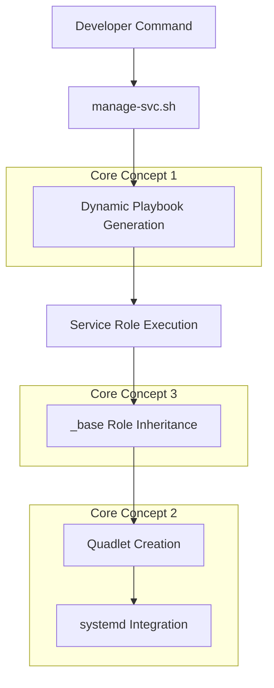

# SOLTI Core Concepts - Architectural Innovations

> **Understanding the fundamental design patterns that make SOLTI containers powerful, flexible, and maintainable.**

## 🏗️ The Three Pillars

SOLTI containers is built on three core architectural innovations that work together to create a powerful, flexible system:

1. **[Podman Quadlets](#podman-quadlets)** - Modern container-to-systemd integration
2. **[Dynamic Playbook Generation](#dynamic-playbook-generation)** - Inventory-driven automation
3. **[Role Inheritance Pattern](#role-inheritance-pattern)** - Shared functionality via `_base` role

These aren't just implementation details—they're the foundation that enables the entire system's flexibility and maintainability.

---

## 🔧 Podman Quadlets - The Modern Container Pattern

### What Are Quadlets?

Quadlets represent a paradigm shift from traditional container management. Instead of the old two-step process:

1. Create containers with Podman
2. Generate systemd units with `podman generate systemd`

Quadlets provide a **single, declarative file** that defines both container configuration and systemd service behavior.

### The Traditional Problem

Before Quadlets, you had this fragile workflow:

```bash
# Step 1: Create containers
podman pod create --name myapp
podman run --pod myapp --name myapp-db postgres

# Step 2: Generate systemd units
podman generate systemd --name myapp > myapp.service
systemctl --user enable myapp.service

# Problem: Changes require regenerating everything
```

### The Quadlet Solution

With Quadlets, everything is declarative:

```ini
# elasticsearch.pod
[Pod]
PublishPort=127.0.0.1:9200:9200
PublishPort=127.0.0.1:8088:8080

# elasticsearch-svc.container  
[Container]
Pod=elasticsearch.pod
Image=docker.io/elasticsearch:8.12.1
Volume=/home/user/elasticsearch-data/config:/usr/share/elasticsearch/config:Z,U
```

### Key Quadlet Insights

**Filename Becomes Identity**

- Pod file: `elasticsearch.pod` → systemd service: `elasticsearch-pod.service`
- Container references pod: `Pod=elasticsearch.pod`
- No explicit naming—systemd derives everything from filenames

**Single Source of Truth**

- Container config + systemd config in one place
- Version control friendly
- No manual unit file generation

**Automatic Systemd Integration**

- Quadlets become proper systemd services
- Standard `systemctl` commands work
- Dependency management via systemd

### Why This Matters for SOLTI

Every SOLTI service uses Quadlets because they provide:

- **Consistency** - Same pattern across all services
- **Maintainability** - No generated files to keep in sync  
- **Integration** - Native systemd service management
- **Scalability** - Easy to add new containers to existing pods

---

## ⚡ Dynamic Playbook Generation - Inventory-Driven Automation

### The Anti-Pattern: Hardcoded Playbooks

Traditional approach requires maintaining separate playbooks for every operation:

```
playbooks/
├── deploy-elasticsearch.yml
├── remove-elasticsearch.yml  
├── deploy-redis.yml
├── remove-redis.yml
├── deploy-mattermost.yml
└── remove-mattermost.yml
```

**Problems:**

- Massive code duplication
- Hard to maintain consistency
- Changes require editing multiple files
- No flexibility for different environments

### The SOLTI Solution: Generate Don't Maintain

Instead of maintaining static playbooks, SOLTI **generates them dynamically** based on:

- Service name
- Action (prepare/deploy/remove)
- Inventory variables
- Role defaults

```bash
# This generates a playbook on-the-fly:
./manage-svc.sh elasticsearch deploy

# Creates this playbook dynamically:
---
- name: Manage elasticsearch Service  
  hosts: elasticsearch_svc
  vars:
    elasticsearch_state: present
  roles:
    - role: elasticsearch
```

### The Power of `manage-svc.sh`

```bash
#!/bin/bash
# Generate playbook from template
generate_playbook() {
    local service="$1"
    local action="$2" 
    local state="${STATE_MAP[$action]}"
    
    # Create playbook directly with proper substitutions
    cat > "$TEMP_PLAYBOOK" << EOF
---
- name: Manage ${service} Service
  hosts: ${service}_svc
  vars:
    ${service}_state: ${state}
  roles:
    - role: ${service}
EOF
}
```

**This simple pattern eliminates hundreds of lines of duplicate playbook code.**

### Why This Is Brilliant

**Single Pattern, Infinite Flexibility**

- One script handles all services
- Actions map to role states (prepare/present/absent)
- Inventory provides all customization

**Inventory-Driven Configuration**

- Service-specific variables in inventory
- No hardcoded values in automation
- Environment-specific overrides possible

**Error-Resilient Debugging**

- Generated playbooks preserved on failure
- Full Ansible debugging available
- Transparent operation—you can see exactly what runs

### Advanced Usage Patterns

```bash
# The same pattern works for any service:
./manage-svc.sh redis deploy
./manage-svc.sh mattermost deploy  
./manage-svc.sh hashivault deploy

# And any action:
./manage-svc.sh elasticsearch prepare
./manage-svc.sh elasticsearch remove

# Service-specific tasks via svc-exec.sh:
./svc-exec.sh elasticsearch verify
./svc-exec.sh hashivault initialize
./svc-exec.sh mattermost configure
```

---

## 🧬 Role Inheritance Pattern - The Hidden Gem

### The Challenge: Shared Functionality

When building multiple container services, you encounter repeated patterns:

- Directory creation and permissions
- SELinux context configuration  
- Container networking setup
- Systemd service management
- Cleanup procedures

### Traditional Solutions (And Their Problems)

**Copy-Paste Code**

```yaml
# In every role's tasks/main.yml:
- name: Create directories
  file:
    path: "{{ service_data_dir }}/{{ item }}"
    state: directory
  loop: ["config", "data", "logs"]
```

*Problem: Multiply this by 6 services = maintenance nightmare*

**Shared Tasks Files**

```yaml
# Include shared tasks
- include_tasks: ../../shared/create-directories.yml
```

*Problem: Hard to parameterize, breaks role encapsulation*

### The SOLTI Solution: Role Inheritance

SOLTI implements true role inheritance via the `_base` role:

```yaml
# Every service role calls:
- name: Base prepare
  ansible.builtin.include_tasks:
    file: ../_base/tasks/prepare.yml
```

### The `_base` Role Architecture

```
roles/_base/
├── defaults/main.yml           # Common defaults
├── tasks/
│   ├── prepare.yml            # Directory setup, SELinux  
│   ├── networks.yml           # Container networking
│   ├── cleanup.yml            # Service removal
│   └── containers.yml         # Common container patterns
└── templates/
    └── common-configs/        # Shared configuration templates
```

### How Inheritance Works

**1. Service Properties Pattern**
Each service defines its structure:

```yaml
service_properties:
  root: "elasticsearch"
  name: "elasticsearch-pod" 
  pod_key: "elasticsearch.pod"
  quadlets:
    - "elasticsearch-svc.container"
    - "elasticsearch-gui.container"
    - "elasticsearch.pod"
  data_dir: "{{ elasticsearch_data_dir }}"
  dirs:
    - { path: "", mode: "0750" }
    - { path: "config", mode: "0775" }
    - { path: "data", mode: "0770" }
```

**2. Base Role Uses Properties**
The `_base` role operates on these properties generically:

```yaml
# _base/tasks/prepare.yml
- name: Create service directories
  become: "{{ needs_root | bool }}"
  ansible.builtin.file:
    path: "{{ service_properties.data_dir }}{{ '/' + item.path if item.path != '' else '' }}"
    state: directory
    mode: "{{ item.mode }}"
  loop: "{{ service_properties.dirs }}"
```

**3. Consistent Patterns Across Services**
Every service gets the same robust setup:

- Proper directory structure
- Correct permissions  
- SELinux contexts
- Container networking
- Systemd integration

### Why This Is Revolutionary

**DRY Principle at Scale**

- Write directory creation logic once
- Implement SELinux handling once  
- Build cleanup procedures once
- All services inherit robust, tested patterns

**Consistency Guarantee**

- Every service follows identical patterns
- No service-specific implementation drift
- Bugs fixed in `_base` fix all services

**Extensibility**

- New services automatically get all base functionality
- Adding features to `_base` enhances all services
- Service-specific customization still possible

### Real-World Impact

Compare implementing a new service:

**Without Inheritance (Traditional)**

```yaml
# 150+ lines per service for:
- Directory creation
- Permission handling  
- SELinux configuration
- Network setup
- Cleanup procedures
- Error handling
```

**With SOLTI Inheritance**

```yaml
# 3 lines in service role:
- name: Base prepare
  ansible.builtin.include_tasks:
    file: ../_base/tasks/prepare.yml
```

**Result: 98% reduction in boilerplate code.**

---

## 🔄 How The Concepts Work Together

### The Complete Flow



### Example: Deploying Elasticsearch

1. **Command**: `./manage-svc.sh elasticsearch deploy`

2. **Dynamic Generation**: Creates playbook:

   ```yaml
   - hosts: elasticsearch_svc
     vars:
       elasticsearch_state: present
     roles:
       - role: elasticsearch
   ```

3. **Role Inheritance**: Elasticsearch role calls `_base`:

   ```yaml
   - include_tasks: ../_base/tasks/prepare.yml
   - include_tasks: ../_base/tasks/networks.yml  
   ```

4. **Quadlet Creation**: Generates systemd-compatible container definitions:

   ```ini
   [Container]
   Pod=elasticsearch.pod
   Image=docker.io/elasticsearch:8.12.1
   ```

5. **systemd Integration**: Service becomes manageable:

   ```bash
   systemctl --user status elasticsearch-pod
   ```

### The Multiplier Effect

Because these concepts work together:

- **Adding a new service** takes minutes, not hours
- **Changes to base functionality** improve all services instantly  
- **Debugging** is consistent across all services
- **Deployment patterns** are identical everywhere

---

## 🎯 Why This Architecture Matters

### For Developers

**Consistency**: Every service works the same way

```bash
./manage-svc.sh <any-service> deploy
./svc-exec.sh <any-service> verify
```

**Predictability**: Same patterns, same debugging, same management

**Speed**: New services inherit years of refinement instantly

### For Operations

**Maintainability**: Fix once, benefit everywhere

**Reliability**: Battle-tested patterns across all services

**Observability**: Consistent logging, monitoring, error handling

### For the Future

**Extensibility**: New concepts can be added to `_base` and inherited by all

**Scalability**: Pattern works for 6 services or 60 services

**Evolution**: Architecture can grow without breaking existing services

---

## 🚀 The Innovation Summary

SOLTI containers demonstrates three cutting-edge patterns working in harmony:

1. **Quadlets** solve the container-to-systemd integration problem elegantly
2. **Dynamic playbook generation** eliminates maintenance overhead while preserving flexibility  
3. **Role inheritance** provides true code reuse with zero coupling

Together, they create a system that is:

- **Maintainable** - Changes in one place affect all services
- **Consistent** - Identical patterns everywhere
- **Flexible** - Inventory-driven customization  
- **Debuggable** - Full transparency and error preservation
- **Extensible** - New services inherit all innovations

This isn't just "infrastructure as code"—it's **"architecture as patterns"** that scales both technically and organizationally.

---

## 🔗 Related Documentation

- [Podman Quadlet Article](podman-quadlet-article.md) - Deep dive into Quadlet implementation
- [Project README](README.md) - Complete project overview
- [Service Template](service-template.md) - How to create new services using these patterns

*These core concepts are what make SOLTI containers more than just "another container deployment tool"—they represent a new approach to infrastructure automation that prioritizes maintainability, consistency, and developer experience.*
