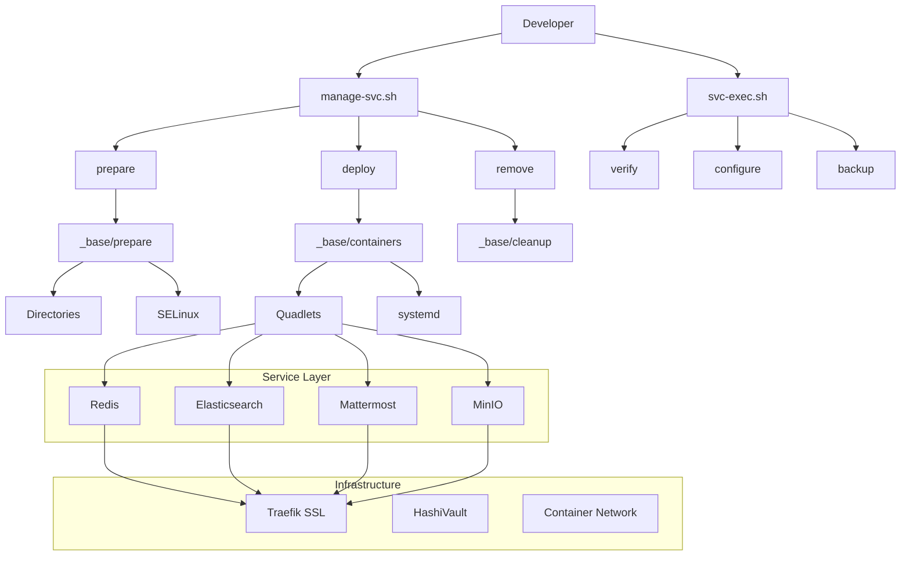

# SOLTI Containers - Lightweight Development Services

> **A comprehensive Ansible collection for deploying containerized development and testing services using Podman, Quadlets, and systemd integration.**

## 🎯 Project Philosophy

Modern development requires lightweight, ephemeral services that can be quickly deployed, tested, and removed. Virtual machines are too heavy for rapid iteration cycles. This collection addresses the need for:

- **Consistent deployment patterns** across different services
- **Lightweight testing environments** using containers instead of VMs  
- **Easy service lifecycle management** (prepare → deploy → verify → remove)
- **Standardized configuration** with security best practices
- **Rapid iteration** for development and testing workflows

I always use the latest version of the container. This can be painful sometimes. I did not intend for these to be long running services. They are here to satisfy a need for rapid development on the developer machine.

You may ask why not a Debian distro? That is because Podman is RHEL-focused and the versions on Debian are behind. Debian distributions are generally better at Docker. I prefer to have non-privileged containers.

## 🚀 Quick Start

There are two places I test: localhost and a Fedora server VM named podman.

There are two scripts that manage container lifecycle:

1. **`manage-svc.sh`** - Service lifecycle management:
   - `prepare`: Create data directories and apply SELinux contexts (RHEL/Fedora)
   - `deploy`: Deploy pod and containers using Podman quadlets
   - `remove`: Stop and remove containers (preserves data by default)

2. **`svc-exec.sh`** - Task execution (verify, check_upgrade, configure)

### Local Deployment

```bash
# Deploy container stack
./manage-svc.sh <service> prepare && ./manage-svc.sh <service> deploy

# Verify the container stack
./svc-exec.sh <service> verify

# Check for updated container
./svc-exec.sh <service> check_upgrade

# Clean up (preserves data)
./manage-svc.sh <service> remove

# Full removal using env variables
DELETE_DATA=true DELETE_IMAGES=true ./manage-svc.sh <service> remove
```

**Available services:**

- elasticsearch
- hashivault
- redis
- mattermost
- traefik
- minio
- wazuh
- grafana
- gitea
- influxdb3
- mongodb
- obsidian

### Remote Host Deployment

```bash
# Deploy to remote host (e.g., podma)
./manage-svc.sh -h podma -i inventory/podma.yml redis prepare
./manage-svc.sh -h podma -i inventory/podma.yml redis deploy

# Verify remote service
./svc-exec.sh -h podma -i inventory/podma.yml redis verify

# Clean up remote host
./manage-svc.sh -h podma -i inventory/podma.yml redis remove
```

> **Note**: `manage-svc.sh` will prompt for your sudo password. This is required because containers create files with elevated ownership that your user cannot modify without privileges.

## 📋 Service Catalog

### Production-Ready Services

| Service | Purpose | Ports | SSL Domain | Status |
|---------|---------|-------|------------|--------|
| **[Redis](roles/redis/README.md)** | Fast key-value store for test data collection | 6379, 8081 | `redis-ui.domain.com` | ✅ Ready |
| **[Elasticsearch](roles/elasticsearch/README.md)** | Search and analytics engine for logs | 9200, 8088 | `elasticsearch.domain.com` | ✅ Ready |
| **[HashiVault](roles/hashivault/README.md)** | Comprehensive secrets management | 8200, 8201 | `vault.domain.com` | ✅ Ready |
| **[Mattermost](roles/mattermost/README.md)** | Team communication and notifications | 8065 | `mattermost.domain.com` | ✅ Ready |
| **[Traefik](roles/traefik/README.md)** | HTTP reverse proxy with SSL termination | 8080, 8443, 9999 | `*.domain.com` | ✅ Ready |
| **[MinIO](roles/minio/README.md)** | S3-compatible object storage | 9000, 9001 | `minio.domain.com` | ✅ Ready |
| **[Gitea](roles/gitea/README.md)** | Lightweight Git hosting service | 3000, 2222 | `gitea.domain.com` | ✅ Ready |
| **[Grafana](roles/grafana/README.md)** | Metrics visualization and dashboards | 3001 | `grafana.domain.com` | ✅ Ready |
| **[InfluxDB3](roles/influxdb3/README.md)** | Time-series database for metrics storage | 8086 | `influxdb.domain.com` | ✅ Ready |

### Development Status

| Service | Status | Notes |
|---------|--------|-------|
| **Wazuh** | 🚧 Disabled | Container issues, will be removed in next version |
| **Jepson** | 📋 Planned | Fuzzing framework |
| **Trivy** | 📋 Planned | Vulnerability scanner |

## 🏗️ Architecture Overview

### The SOLTI Pattern

All services follow a consistent pattern based on the `_base` role:

```
┌─────────────────────────────────────────────────────────────────┐
│                        Service Layer                           │
├─────────────────┬─────────────────┬─────────────────┬─────────────┤
│     Redis       │  Elasticsearch  │   Mattermost    │   MinIO     │
│   (Testing)     │   (Analytics)   │  (Communication)│  (Storage)  │
└─────────────────┴─────────────────┴─────────────────┴─────────────┘
                              │
┌─────────────────────────────────────────────────────────────────┐
│                      Infrastructure Layer                       │
├─────────────────┬─────────────────┬─────────────────┬─────────────┤
│    Traefik      │   HashiVault    │     _base       │   Quadlets  │
│  (SSL Proxy)    │   (Secrets)     │   (Common)      │  (systemd)  │
└─────────────────┴─────────────────┴─────────────────┴─────────────┘
                              │
┌─────────────────────────────────────────────────────────────────┐
│                       Platform Layer                           │
├─────────────────┬─────────────────┬─────────────────┬─────────────┤
│     Podman      │     systemd     │    SELinux      │   Network   │
│  (Containers)   │   (Services)    │  (Security)     │   (ct-net)  │
└─────────────────┴─────────────────┴─────────────────┴─────────────┘
```

### Service Integration Flow



## 🛠️ Management Interface

### Primary Commands

#### Service Lifecycle (`manage-svc.sh`)

```bash
# System preparation (one-time per service)
./manage-svc.sh <service> prepare

# Deploy and start service
./manage-svc.sh <service> deploy

# Remove service (preserves data by default)
./manage-svc.sh <service> remove
```

**Note**: Requires sudo password - containers create files with elevated ownership requiring privilege escalation for prepare/deploy/remove operations.

#### Service Operations (`svc-exec.sh`)

```bash
# Execute verification tasks
./svc-exec.sh <service> verify

# Run service-specific tasks
./svc-exec.sh <service> configure
./svc-exec.sh <service> backup
./svc-exec.sh <service> initialize

# Use sudo for privileged operations
./svc-exec.sh -K <service> <task>
```

### Script Features

- **Dynamic playbook generation** - Creates Ansible playbooks on-the-fly
- **Inventory integration** - Uses your inventory variables and defaults
- **Error handling** - Preserves generated playbooks on failure for debugging
- **Cleanup automation** - Removes successful temporary playbooks
- **Flexible task execution** - Any role task file can be executed independently

## 🌐 SSL and Networking

### Automatic SSL with Traefik

When Traefik is deployed, all services automatically get SSL termination:

```bash
# Deploy Traefik first
./manage-svc.sh traefik prepare
./manage-svc.sh traefik deploy

# Now all other services get automatic SSL
./manage-svc.sh redis deploy     # → https://redis-ui.yourdomain.com
./manage-svc.sh mattermost deploy # → https://mattermost.yourdomain.com
```

### DNS Requirements

Point wildcard DNS to your development machine:

```
*.yourdomain.com → 192.168.1.100
```

### Container Networking

All services use a common network with consistent DNS:

```yaml
service_network: "ct-net"
service_dns_servers: ["1.1.1.1", "8.8.8.8"]
service_dns_search: "yourdomain.com"
```

## 🔧 System Requirements

### Minimum Requirements

- **OS**: RHEL 9+, CentOS 9+, Debian 12+, Ubuntu 22.04+
- **Podman**: 4.x or later
- **systemd**: User services enabled (`loginctl enable-linger $USER`)
- **Memory**: 4GB RAM minimum, 8GB recommended
- **Storage**: 20GB free space for service data

### Recommended Setup

- **CPU**: 4+ cores for multiple concurrent services
- **Memory**: 16GB for full service stack
- **Storage**: SSD storage for better I/O performance
- **Network**: Stable internet for Let's Encrypt certificates

### Prerequisites Installation

```bash
# RHEL/CentOS/Rocky Linux
sudo dnf install podman ansible-core python3-pip
pip3 install --user containers.podman

# Debian/Ubuntu  
sudo apt install podman ansible python3-pip
pip3 install --user containers.podman

# Enable user services
loginctl enable-linger $USER
```

## 📁 Project Structure

```
solti-containers/
├── roles/                          # Service role definitions
│   ├── _base/                      # Common functionality
│   │   ├── tasks/
│   │   │   ├── prepare.yml         # Directory and permission setup
│   │   │   ├── networks.yml        # Container networking
│   │   │   └── cleanup.yml         # Service removal
│   │   └── defaults/main.yml       # Common defaults
│   │
│   ├── redis/                      # Redis key-value store
│   ├── elasticsearch/              # Search and analytics
│   ├── hashivault/                 # Secrets management
│   ├── mattermost/                 # Team communication
│   ├── traefik/                    # SSL reverse proxy
│   └── minio/                      # S3-compatible storage
│
├── inventory.yml                   # Service configuration
├── ansible.cfg                     # Ansible settings
├── manage-svc.sh                   # Service lifecycle management
├── svc-exec.sh                     # Task execution wrapper
└── README.md                       # This file
```

### Role Structure Pattern

Each service role follows this structure:

```
roles/<service>/
├── defaults/main.yml               # Default variables
├── handlers/main.yml               # Service restart handlers
├── meta/main.yml                   # Role metadata
├── tasks/
│   ├── main.yml                   # Role entry point
│   ├── prepare.yml                # System preparation
│   ├── prerequisites.yml          # Configuration setup
│   ├── quadlet_rootless.yml       # Container deployment
│   ├── verify.yml                 # Health verification
│   └── <service-specific>.yml     # Custom tasks
└── templates/
    ├── <service>.conf.j2          # Service configuration
    └── <service>.env.j2           # Environment variables
```

## 🔐 Security Model

### Container Security

- **Rootless containers** - All services run without root privileges
- **SELinux integration** - Proper security contexts on RHEL systems  
- **Network isolation** - Services communicate via dedicated container network
- **Resource limits** - Memory and CPU constraints prevent resource exhaustion

### Access Control

- **Localhost binding** - Services bind to 127.0.0.1 by default
- **Password protection** - All services require authentication
- **SSL/TLS encryption** - Traefik provides automatic HTTPS
- **API tokens** - Role-based access where supported

### Data Protection

- **Volume encryption** - Data stored in user directories with proper permissions
- **Backup integration** - Services support data backup and restore
- **Secrets management** - HashiVault integration for credential storage

## 🧪 Development Workflows

### Testing New Features

```bash
# Create isolated test environment
./manage-svc.sh redis deploy
./manage-svc.sh elasticsearch deploy

# Run your tests against the services
pytest tests/ --redis-url=localhost:6379 --es-url=localhost:9200

# Analyze results
./svc-exec.sh redis verify
./svc-exec.sh elasticsearch verify

# Clean up
./manage-svc.sh redis remove
./manage-svc.sh elasticsearch remove
```

### Service Development

```bash
# Test single service changes
./manage-svc.sh myservice prepare
./manage-svc.sh myservice deploy
./svc-exec.sh myservice verify

# Make changes to role
vim roles/myservice/tasks/main.yml

# Redeploy with changes
./manage-svc.sh myservice deploy
./svc-exec.sh myservice verify
```

### Iterative Development with Data Persistence

The `-K` flag combined with data preservation enables rapid "iterate until you get it right" workflow:

```bash
# Initial deployment
./manage-svc.sh elasticsearch deploy

# Test and discover issues
./svc-exec.sh elasticsearch verify

# Remove container (data preserved by default)
./manage-svc.sh elasticsearch remove

# Modify role: edit tasks, templates, configuration
vim roles/elasticsearch/tasks/prerequisites.yml

# Redeploy with your changes - data still intact
./manage-svc.sh elasticsearch deploy

# Your test data, indices, and configurations persist!
# Repeat this cycle until working correctly
```

**Key Benefits**:

- **Data persists across cycles**: Elasticsearch indices, Mattermost channels, database records remain intact
- **Faster iteration**: No need to recreate test data after each change
- **True testing**: Work with realistic data throughout development

**Data-Centric Services** (benefit from persistence):

- elasticsearch (indices, mappings)
- mattermost (channels, messages, users)
- minio (buckets, objects)
- hashivault (secrets, policies)

**Stateless Services** (less critical):

- redis (just cache)
- traefik (just proxy configuration)

**When to Reset Data**:

```bash
# Set in inventory.yml for full cleanup
elasticsearch_delete_data: true
./manage-svc.sh elasticsearch remove  # Removes data directories
```

### Integration Testing

```bash
# Deploy full stack
for service in traefik redis elasticsearch mattermost; do
    ./manage-svc.sh $service prepare
    ./manage-svc.sh $service deploy
done

# Run integration tests
./svc-exec.sh traefik verify
for service in redis elasticsearch mattermost; do
    ./svc-exec.sh $service verify
done

# Test cross-service communication
./test-integration.sh
```

## 🔄 Data Management

### Backup Strategy

Each service supports backup operations:

```bash
# Backup service data
./svc-exec.sh <service> backup

# Backup with compression
./svc-exec.sh <service> backup --compress

# Backup to specific location
./svc-exec.sh <service> backup --dest /backup/location
```

### Data Persistence

- **Data preservation** - `remove` command preserves data by default
- **Complete cleanup** - Set `<SERVICE>_DELETE_DATA=true` to remove all data
- **Volume management** - Data stored in `~/service-data/` directories
- **Migration support** - Data directories can be moved/copied between systems

### Disaster Recovery

```bash
# Backup critical service data
for service in hashivault mattermost; do
    ./svc-exec.sh $service backup
done

# Restore from backup
./svc-exec.sh <service> restore --from /backup/location

# Verify restored service
./svc-exec.sh <service> verify
```

## 🎛️ Monitoring and Observability

### Health Monitoring

```bash
# Check all service status
systemctl --user status | grep -E "(redis|elasticsearch|mattermost)"

# Resource utilization
podman stats --format "table {{.Name}}\t{{.CPUPerc}}\t{{.MemUsage}}"

# Network connectivity
./svc-exec.sh traefik verify
```

### Log Aggregation

```bash
# Centralized logging via Elasticsearch
./manage-svc.sh elasticsearch deploy

# Configure log forwarding (example)
for service in redis mattermost; do
    ./svc-exec.sh $service configure-logging
done

# Search logs via Elasticvue
open https://elasticsearch.yourdomain.com:8088
```

### Performance Monitoring

```bash
# Service-specific metrics
./svc-exec.sh redis info
./svc-exec.sh elasticsearch stats
./svc-exec.sh mattermost metrics

# Container resource usage
podman stats --format "table {{.Name}}\t{{.CPUPerc}}\t{{.MemUsage}}\t{{.NetIO}}\t{{.BlockIO}}"
```

## 🔧 Troubleshooting

### Common Issues

**Services won't start**

```bash
# Check systemd status
systemctl --user status <service>-pod

# Check container logs
podman logs <service>-svc

# Verify directory permissions
ls -la ~/<service>-data/
```

**SSL certificates not working**

```bash
# Check Traefik status
./svc-exec.sh traefik verify

# Verify DNS configuration
dig +short *.yourdomain.com

# Check certificate logs
podman logs traefik-svc | grep -i acme
```

**Network connectivity issues**

```bash
# Check container network
podman network inspect ct-net

# Test inter-service communication
podman exec redis-svc ping elasticsearch-svc

# Verify port bindings
ss -tlnp | grep -E "(6379|9200|8065)"
```

### Debug Mode

```bash
# Enable debug logging
export SOLTI_DEBUG=1

# Run with verbose output
./manage-svc.sh <service> deploy -vvv

# Check generated playbooks
ls -la tmp/<service>-*.yml
```

## 🤝 Contributing

### Adding New Services

1. Follow the [Service Template](service-template.md)
2. Implement the standard task files
3. Add Traefik integration labels
4. Include comprehensive verification tasks
5. Update management scripts as needed

### Development Guidelines

1. **Consistency** - Follow established patterns
2. **Documentation** - Include comprehensive README
3. **Testing** - Add verification tasks
4. **Security** - Implement proper access controls
5. **Integration** - Support Traefik SSL and HashiVault secrets

### Testing Changes

```bash
# Test role syntax
ansible-playbook --syntax-check roles/<service>/tasks/main.yml

# Test deployment
./manage-svc.sh <service> prepare
./manage-svc.sh <service> deploy
./svc-exec.sh <service> verify

# Test cleanup
./manage-svc.sh <service> remove
```

## 📚 Additional Resources

### Documentation

- [Service Template](service-template.md) - Template for creating new services
- [Traefik Integration Guide](traefik-integration.md) - SSL setup and configuration
- [Security Best Practices](security-guide.md) - Security recommendations
- [Performance Tuning](performance-guide.md) - Optimization guidelines

### External References

- [Podman Documentation](https://docs.podman.io/)
- [Quadlets Guide](https://docs.podman.io/en/latest/markdown/podman-systemd.unit.5.html)
- [Ansible Collections](https://docs.ansible.com/ansible/latest/collections_guide/)
- [Traefik Documentation](https://doc.traefik.io/traefik/)

## 📄 License

MIT License - See [LICENSE](LICENSE) file for details.

## 👨‍💻 Maintained By

**Jackaltx** - Created for development testing workflows with significant assistance from Claude AI for pattern development and documentation.

### Project Goals

This project aims to provide:

- Lightweight alternatives to heavy VM-based development environments
- Consistent patterns for containerized service deployment
- Easy-to-use management interfaces for rapid iteration
- Production-ready security and monitoring capabilities
- Educational examples of modern container orchestration

### Support

- **Issues**: Report bugs or request features via GitHub issues
- **Documentation**: Comprehensive README files in each role
- **Community**: Share your service implementations and improvements

---

*Happy containerizing! 🐋*
